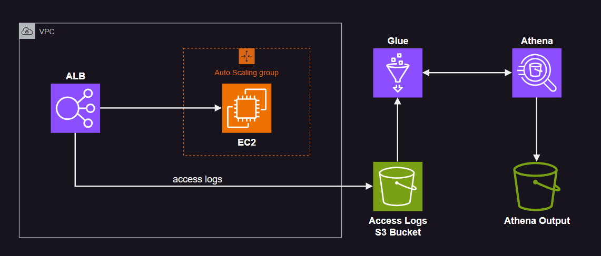
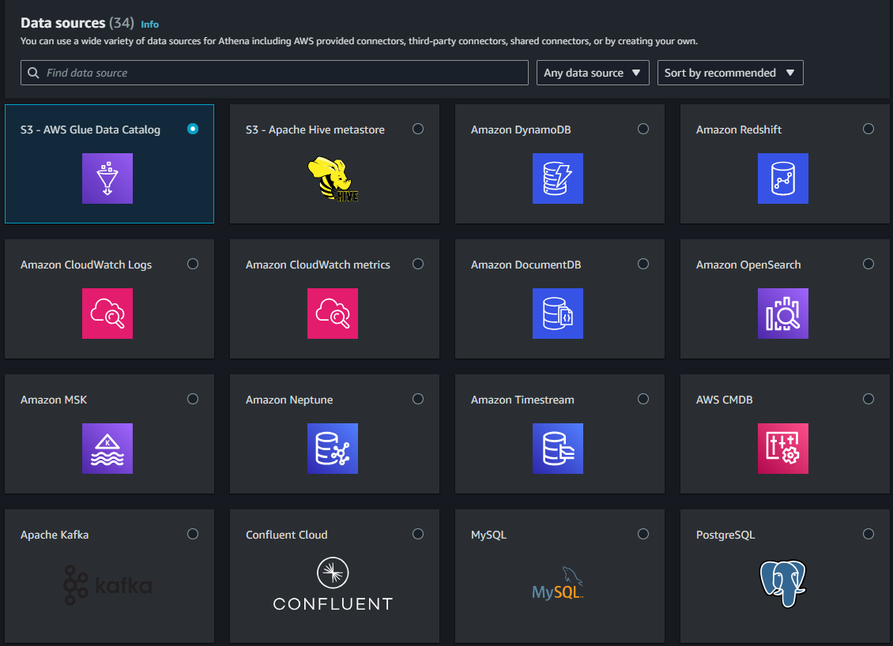
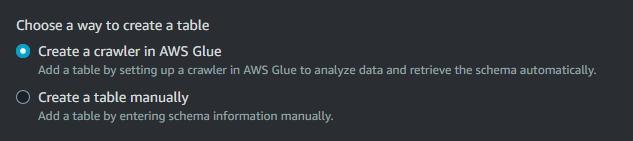

# AWS ELB + Access Logs

Application Load Balancer sending access logs do S3.

Server-side encryption for this integration only supports Amazon S3-managed keys (SSE-S3).

Reference [from the docs][1]:

> The only server-side encryption option that's supported is Amazon S3-managed keys (SSE-S3). For more information, see Amazon S3-managed encryption keys (SSE-S3).




## Start the Workload

Create the temporary key pair:

```sh
mkdir -p keys
ssh-keygen -f keys/temp_key
```

Copy the sample `.auto.tfvars` file:

```sh
cp samples/sample.tfvars .auto.tfvars
```

Start the environment:

```sh
terraform init
terraform apply -auto-approve
```

ELB will confirm that the configuration worked by creating the file `ELBAccessLogTestFile`:

```
https://<bucket>.s3.<region>.amazonaws.com/<prefix>/AWSLogs/<account>/ELBAccessLogTestFile
```

Once traffic starts coming in to ELB the access logs will be generated in the S3. You can use Athena to query the results.

## Querying with Athena

Once access are on an S3 bucket, it is time to analyze it. This next section will follow the documentation for [Querying Application Load Balancer logs][2].

We'll use Glue + Athena to achieve that.

It is worth remembering that Athena can query several data sources:



To query the ELB access logs available on S3, a database is required, and the Terraform scripts will create one.

It is possible to do it manually by creating a table, or by using Glue data crawler.



Create a table directly from Athena. There are two options:

- No partitions
- With partitions

As per documentation for PARTITIONED table:

> Because ALB logs have a known structure whose partition scheme you can specify in advance, you can reduce query runtime and automate partition management by using the Athena partition projection feature. Partition projection automatically adds new partitions as new data is added. This removes the need for you to manually add partitions by using `ALTER TABLE ADD PARTITION`.

Use the local file [`alb_logs.sql`](alb_logs.sql) as a reference, but try getting it fresh from the documentation. It is necessary to replace the S3 data source references in the Athena SQL command. The value is provided as an output by Terraform.

```
s3://your-alb-logs-directory/AWSLogs/<ACCOUNT-ID>/elasticloadbalancing/<REGION>/
```

Terraform will also prepare an Athena Workgroup with a dedicated S3 output.

All you have to do now is select the `elb-access-logs` Workgroup.

## Example queries for ALB logs

I copied these queries from the documentation:

> View the first 100 access log entries in chronological order

```sql
SELECT *  
FROM alb_logs  
ORDER by time ASC  
LIMIT 100
```

> List all client IP addresses that accessed the Application Load Balancer, and how many times they accessed the Application Load Balancer

```sql
SELECT distinct client_ip, count() as count from alb_logs  
GROUP by client_ip  
ORDER by count() DESC;
```

> The following query counts the number of HTTP GET requests received by the load balancer grouped by the client IP address:

```sql
SELECT COUNT(request_verb) AS
 count,
 request_verb,
 client_ip
FROM alb_logs
GROUP BY request_verb, client_ip
LIMIT 100;
```

> Another query shows the URLs visited by Safari browser users:

```sql
SELECT request_url
FROM alb_logs
WHERE user_agent LIKE '%Safari%'
LIMIT 10;
```

> The following query shows records that have ELB status code values greater than or equal to 500.

```sql
SELECT * FROM alb_logs
WHERE elb_status_code >= 500
```

> The following example shows how to parse the logs by `datetime`:

```sql
SELECT client_ip, sum(received_bytes) 
FROM alb_logs
WHERE parse_datetime(time,'yyyy-MM-dd''T''HH:mm:ss.SSSSSS''Z') 
     BETWEEN parse_datetime('2018-05-30-12:00:00','yyyy-MM-dd-HH:mm:ss') 
     AND parse_datetime('2018-05-31-00:00:00','yyyy-MM-dd-HH:mm:ss') 
GROUP BY client_ip;
```

> The following query queries the table that uses partition projection for all ALB logs from the specified day.

```sqld
SELECT * 
FROM alb_logs 
WHERE day = '2022/02/12'
```


---

### Clean-up

```sh
terraform destroy -auto-approve
```

[1]: https://docs.aws.amazon.com/elasticloadbalancing/latest/application/enable-access-logging.html#access-log-create-bucket
[2]: https://docs.aws.amazon.com/athena/latest/ug/application-load-balancer-logs.html
